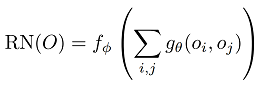

# GAN Learning using RN

## Approach

According to [SA-GAN](https://arxiv.org/abs/1805.08318), one of the problems with the general GAN is that it tries to calculate relations between distant features only as a convolution layer that extracts local features. SA-GAN solved this problem through the Self-Attension layer.

[RN](https://arxiv.org/abs/1706.01427) is explicitly compute relations between distant features.



(If you want to know more about RN and SA-GAN, read linked papers.)

I thought about using RN to create a discriminator to solve the problem. Experimental results show that this method has a generalization effect and relation calculation effect as compared with DCGAN, but it did not seem to have a perfectly good effect. However, it is expected that there will be a better effect if there is a fine network configuration.

## Requirements

- Python3
- Pytorch 1.0.0
- TensorBoardX

## Usage

train
```
python train.py 
    --batch_size [64]
    --image_size [256]
    --n_epoch [200]
    --lr_d [2e-4]
    --lr_g [2e-4]
    --dataset [./celebA-HQ]
    --init [kaiming]
    --nz [128]
    --ngf [64]
    --ndf [64]
    --result_dir [result]
    --model_dir [models]
    --gan_type vanilla|lsgan (Now LSGAN does not work properly.)
    --g_type [dcgan]
    --d_type [rngan]
    --resume []
    --seed [12345]
    --n_cpu [4]
```

## Result

Train with [celebA-HQ dataset](https://arxiv.org/abs/1710.10196)

RNGAN Result (RN discriminator and DCGAN generator)


DCGAN Result (DCGAN discriminator and DCGAN generator)


